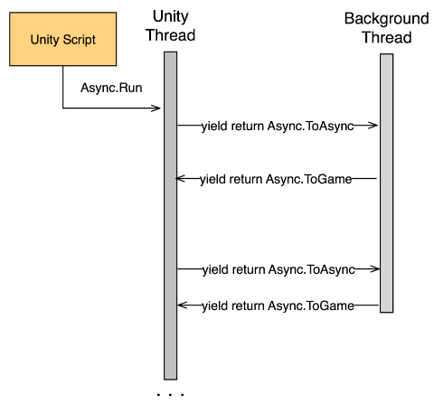

# UnityAsyncRoutines
An extremely lightweight Unity library for creating and managing asynchronous coroutines for easy, straight-forward multi-threading and parallellism.

## Getting started

To get started, simply download AsyncRoutines.unitypackage from the root of the repository,
or clone the entire repository project. 

## Using Unity Async Routines

Async routines are basically fancy coroutines, only with an expanded set of
possible values to yield. Most fundamentally, yielding Async.ToAsync will
switch the method to run on a thread pool thread, and yield Async.ToGame will
return your method to the game thread.



This is very useful for the cases where you need to execute heavy work, but
you also interact closely with Unity. This ease of switching between threads
is of great assistance when creating asynchronous code.

When you start an async routine using Async.Run, you will receive a handle.
This handle is a convenient way for you to talk about that instance of the
routine in particular. You can stop the routine with the handle, or you can
yield it in a regular, vanilla Unity coroutine and wait for the async routine
to finish.

```csharp
	var handle = Async.Run(CallIPAddressAsync());
	yield return handle;
	handle.stop();
```
	
All of Unity's own coroutine yield instructions are supported so you can, should
you wish, pretend that async routines are simply Unity coroutines. If you don't
intend to use any of the special async routine functonality, though, it is
recommended to simply use Unity's vanilla coroutines.

```csharp
	yield return Async.ToAsync;  // switches to running in background threadpool
	Thread.Sleep(40000); // simulating work in the background thread
	yield return Async.ToGame; // switch back to game thread, you can go back and forth
```
	
You can create new async instructions easily by inheriting from AsyncInstruction.
Look at the pre-existing instructions for a template on how to create an instruction.

It is possible to throttle the game-synced execution of async routines have available.
Throttling is on by default, and set to a max of 25ms per frame.

That's pretty much it. Enjoy!

## Examples

There are a couple of included examples in the Examples scene in this project.  Just run that scene and see the demo, then dig around in the project a bit and modify the code to understand how to use UnityAsyncRoutines.

### Fading a game object over time

This is a simple example of doing work outside of the game loop using Async.  The 'over time' is implemented with a simple call to sleep - which of course you don't want to do in the main game thread.  But you need to be in the game thread to set the color of the gameObject.

Snippet from Example : [FadeColor.cs](Unity%20Async%20Routines/Assets/Plugins/AsyncRoutines/Examples/FadeColor.cs)

```csharp
	IEnumerator Fade()
    {
        yield return Async.ToGame;  // we need to interact with game objects, switch to game thread
        statusText.text = "Async fading started";
        rend.material.color = defaultColor;
        yield return Async.ToAsync; // we are doing non-game stuff, switch out of main thread 
        for (float f = 1f; f >= 0; f -= 0.05f)
        {
            yield return Async.ToGame; // need to do game stuff, switching to game thread
            Color c = rend.material.color;
            c.a = f;
            rend.material.color = c;
            yield return Async.ToAsync; // switch out of game thread
            Thread.Sleep(100);
        }
        Thread.Sleep(2000);
        yield return Async.ToGame; // switch to game thread to set the color back to default
        rend.material.color = defaultColor;
        yield return null; // stop
        statusText.text = "Async fading finished";
        Debug.Log("Async finished fading color");
    } 
```

### Using blocking IO

This example uses the .Net WebClient - which blocks on the return of the url to show how Asych allows you to do blocking IO outside of the unity main thread, yet return with results and update game objects with them - easy as can be.

[CallWebService.cs](Unity%20Async%20Routines/Assets/Plugins/AsyncRoutines/Examples/CallWebService.cs)

```csharp
public class CallWebService : MonoBehaviour {

	public Text displayText;

	public void CallIPAddressServiceSync() {
		displayText.text = "Fetching Ip address... brb.";
		// just to be extra rude
		Thread.Sleep(10000);

		// this blocks on the return of DownloadString
		displayText.text = new WebClient().DownloadString("http://api.ipify.org");
	}

	public void CallIPAddressServiceAsync() {
		var handle = Async.Run(CallIPAddressAsync());
	}

	IEnumerator CallIPAddressAsync() {

		string ip = "IP n/a";
		displayText.text = "Fetching Ip address... brb.";
		yield return Async.ToAsync; // leave the unity thread and do background processing
		// just to be extra rude
		Thread.Sleep(10000);

		// this blocks on the return of DownloadString
		ip = new WebClient().DownloadString("http://api.ipify.org");

		yield return Async.ToGame; // I've got the result, need to return to unity to set the display
		displayText.text = ip;
	}

}
```

### Async Test 

This is actually a great place to continue your study of Async in depth - just take a look at the test code to see examples of Paralell and some of the other more advanced uses of Async.

[AsyncTests.cs](Unity%20Async%20Routines/Assets/Plugins/AsyncRoutines/Tests/AsyncTests.cs)